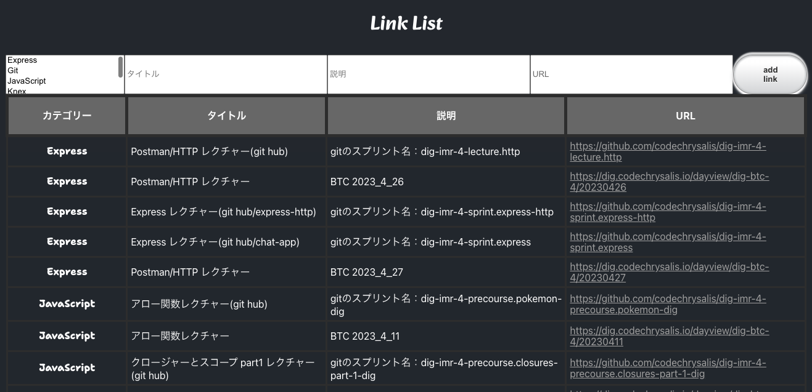

# solo_project：link_list 概要

この project は

・あのレクチャー見返したい・・・いつだっけ？（Viceroy で探す）

・sprint 中や lecture 内で紹介された URL、お気に入りに入れすぎてフォルダがパンパン・ぐちゃぐちゃ 😭

という悩みを解決するために作成しました。

Viceroy へのリンクと Github のレポジトリは BTC4 期生向けのため、関係者以外はリンク先へのアクセスができません。

あらかじめご承知おきください。

カテゴリーで分類しています。

※カテゴリーは別途記載

### アプリのプレビュー

### セットアップと実行方法

1. このレポジトリを clone

1. `psql`で PostgreSQL を起動し、`CREATE DATABASE links;`で links テーブルを作成

1. `\c links`で links テーブルに移動し links テーブルができていることを確認

1. clone したローカルのフォルダを開き、ターミナルで

   front ディレクトリ・back ディレクトリに遷移しそれぞれ npm install を実行
   `cd front`
   `npm install`
   `cd ../back`
   `npm install`

1. back ディレクトリで

   `npm run migrate`を実行しテーブルを作成したら次に

   `npm run seed`を実行しデフォルトデータを登録

1. back ディレクトリで`npm start` を実行し、localhost:3000 にアクセス

# Author

- saki

# License

This is Confidential.

# category 一覧

JavaScript

Express

Knex/postgerSQL

React

TypeScript

テスト

エラー対処

便利ツール

気になる

その他
